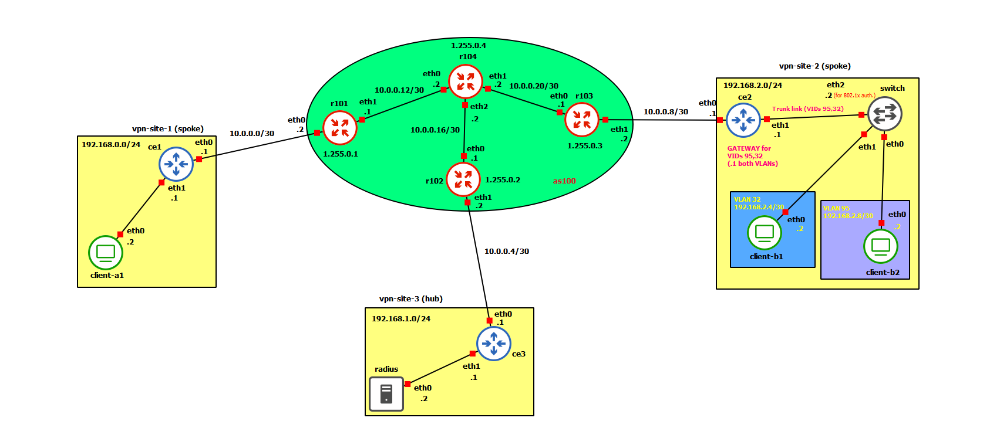

# Progetto #3 del corso di Network and System Defense
Stefano Belli, matricola 0350116
Anno accademico 2024/2025

## Indice
1. [Introduzione](#introduzione)
2. [Configurazione della backbone (AS100)](#configurazione-della-backbone-as100)
3. [Configurazione della VPN site 1](#configurazione-della-vpn-site-1)
4. [Configurazione della VPN site 2](#configurazione-della-vpn-site-2)
5. [Configurazione della VPN site 3](#configurazione-della-vpn-site-3)
4. [Conclusioni](#conclusioni)


## Introduzione

Il progetto prevede l'implementazione di una VPN MPLS/BGP hub-and-spoke con possibilità di comunicazione spoke-to-spoke e
advertisement delle rotte CE-PE eseguita automaticamente. In aggiunta, nella VPN site 1 c'è un dispositivo sensitive,
quindi bisogna impiegare un mandatory access control, nella VPN site 2 ci sono due client che possono accedere alla LAN
solo dopo autenticazione (802.1x), e quindi ricevere un VLAN id automaticamente. Nella VPN site 3 c'è il server RADIUS
che è l'authentication server.



## Configurazione della backbone (AS100)

 * **R101**

 frrconf

```bash
interface eth0
 ip address 10.0.0.2/30

interface eth1
 ip address 10.0.0.13/30

interface lo
 ip address 1.255.0.1/32

router ospf
 router-id 1.255.0.1
 network 1.255.0.1/32 area 0
 network 10.0.0.12/30 area 0
 exit

mpls ldp
 router-id 1.255.0.1
 ordered-control
 address-family ipv4
  discovery transport-address 1.255.0.1
  interface lo
  interface eth1

router bgp 100
 bgp router-id 1.255.0.1
 neighbor 1.255.0.2 remote-as 100
 neighbor 1.255.0.2 update-source 1.255.0.1
 neighbor 1.255.0.3 remote-as 100
 neighbor 1.255.0.3 update-source 1.255.0.1
 address-family ipv4 unicast
  neighbor 1.255.0.2 next-hop-self
  neighbor 1.255.0.3 next-hop-self
 address-family ipv4 vpn
  neighbor 1.255.0.2 activate
  neighbor 1.255.0.2 next-hop-self
  neighbor 1.255.0.3 activate
  neighbor 1.255.0.3 next-hop-self

router bgp 100 vrf vpnA
 neighbor 10.0.0.1 remote-as 65000
 address-family ipv4 unicast
  label vpn export auto
  rd vpn export 100:0
  rt vpn export 100:1
  rt vpn import 100:2
  export vpn
  import vpn
```

 net.sh

```bash
#!/bin/bash

ip link add vpnA type vrf table 10
ip link set vpnA up
ip link set eth0 master vpnA

sysctl -w net.mpls.conf.lo.input=1
sysctl -w net.mpls.conf.eth1.input=1
sysctl -w net.mpls.conf.vpnA.input=1
sysctl -w net.mpls.platform_labels=100000

vtysh -f frrconf
```

 * **R102**

 frrconf

```bash
interface eth1
 ip address 10.0.0.6/30

interface eth0
 ip address 10.0.0.17/30

interface lo
 ip address 1.255.0.2/32

router ospf
 router-id 1.255.0.2
 network 1.255.0.2/32 area 0
 network 10.0.0.16/30 area 0
 exit

mpls ldp
 router-id 1.255.0.2
 ordered-control
 address-family ipv4
  discovery transport-address 1.255.0.2
  interface lo
  interface eth0

router bgp 100
 bgp router-id 1.255.0.2
 neighbor 1.255.0.1 remote-as 100
 neighbor 1.255.0.1 update-source 1.255.0.2
 neighbor 1.255.0.3 remote-as 100
 neighbor 1.255.0.3 update-source 1.255.0.2
 address-family ipv4 unicast
  neighbor 1.255.0.1 next-hop-self
  neighbor 1.255.0.3 next-hop-self
 address-family ipv4 vpn
  neighbor 1.255.0.1 activate
  neighbor 1.255.0.1 next-hop-self
  neighbor 1.255.0.3 activate
  neighbor 1.255.0.3 next-hop-self

router bgp 100 vrf vpnA
 neighbor 10.0.0.5 remote-as 65001
 address-family ipv4 unicast
  redistribute kernel
  label vpn export auto
  rd vpn export 100:0
  rt vpn import 100:1
  rt vpn export 100:2
  import vpn
  export vpn
```

 net.sh

```bash
#!/bin/bash

ip link add vpnA type vrf table 10
ip link set vpnA up
ip link set eth1 master vpnA

sysctl -w net.mpls.conf.lo.input=1
sysctl -w net.mpls.conf.eth0.input=1
sysctl -w net.mpls.conf.vpnA.input=1
sysctl -w net.mpls.platform_labels=100000

vtysh -f frrconf

# default route, enables spoke-to-spoke comm. through hub
ip route add 0.0.0.0/0 via 10.0.0.5 vrf vpnA
```

 * **R103**

 frrconf

```bash
interface eth1
 ip address 10.0.0.10/30

interface eth0
 ip address 10.0.0.21/30

interface lo
 ip address 1.255.0.3/32

router ospf
 router-id 1.255.0.3
 network 1.255.0.3/32 area 0
 network 10.0.0.20/30 area 0
 exit

mpls ldp
 router-id 1.255.0.3
 ordered-control
 address-family ipv4
  discovery transport-address 1.255.0.3
  interface lo
  interface eth0

router bgp 100
 bgp router-id 1.255.0.3
 neighbor 1.255.0.1 remote-as 100
 neighbor 1.255.0.1 update-source 1.255.0.3
 neighbor 1.255.0.2 remote-as 100
 neighbor 1.255.0.2 update-source 1.255.0.3
 address-family ipv4 unicast
  neighbor 1.255.0.1 next-hop-self
  neighbor 1.255.0.2 next-hop-self
 address-family ipv4 vpn
  neighbor 1.255.0.1 activate
  neighbor 1.255.0.1 next-hop-self
  neighbor 1.255.0.2 activate
  neighbor 1.255.0.2 next-hop-self

router bgp 100 vrf vpnA
 neighbor 10.0.0.9 remote-as 65002
 address-family ipv4 unicast
  label vpn export auto
  rd vpn export 100:0
  rt vpn export 100:1
  rt vpn import 100:2
  import vpn
  export vpn
```

 net.sh

```bash
#!/bin/bash

ip link add vpnA type vrf table 10
ip link set vpnA up
ip link set eth1 master vpnA

sysctl -w net.mpls.conf.lo.input=1
sysctl -w net.mpls.conf.eth0.input=1
sysctl -w net.mpls.conf.vpnA.input=1
sysctl -w net.mpls.platform_labels=100000

vtysh -f frrconf
```

 * **R104**

 frrconf

```bash
interface eth0
 ip address 10.0.0.14/30

interface eth2
 ip address 10.0.0.18/30

interface eth1
 ip address 10.0.0.22/30

interface lo
 ip address 1.255.0.4/32

router ospf
 router-id 1.255.0.4
 network 1.255.0.4/32 area 0
 network 10.0.0.20/30 area 0
 network 10.0.0.16/30 area 0
 network 10.0.0.12/30 area 0
 exit

mpls ldp
 router-id 1.255.0.4
 ordered-control
 address-family ipv4
  discovery transport-address 1.255.0.4
  interface lo
  interface eth0
  interface eth1
  interface eth2
```

 net.sh

```bash
#!/bin/bash

sysctl -w net.mpls.conf.lo.input=1
sysctl -w net.mpls.conf.eth0.input=1
sysctl -w net.mpls.conf.eth1.input=1
sysctl -w net.mpls.conf.eth2.input=1
sysctl -w net.mpls.platform_labels=100000

vtysh -f frrconf
```

## Configurazione della VPN site 1

 * **CE1**

 frrconf

```bash
interface eth0
 ip address 10.0.0.1/30

interface eth1
 ip address 192.168.0.1/24

ip route 0.0.0.0/0 10.0.0.2

router bgp 65000
 network 192.168.0.0/24
 neighbor 10.0.0.2 remote-as 100
```

 net.sh

```bash
#!/bin/bash

vtysh -f frrconf
```

 * **client-A1**

 net.sh

```bash
#!/bin/bash

ip addr add 192.168.0.2/24 dev eth0
ip route add default via 192.168.0.1 dev eth0
```

 mac/apply-aaprofs.sh

```bash
#!/bin/bash

PROFSDIR=aaprofs
PROFILES=$(ls $PROFSDIR)

echo "Entering directory $PROFSDIR..."
echo "=================="
echo "------------------"

cd $PROFSDIR

for profile in $PROFILES; do
        echo "Applying AppArmor profile: $profile"
        cp $profile /etc/apparmor.d/$profile
        apparmor_parser /etc/apparmor.d/$profile
        apparmor_parser -r /etc/apparmor.d/$profile
        aa-enforce /etc/apparmor.d/$profile
        echo "------------------"
done

echo "=================="
echo "Exiting directory $PROFSDIR..."

cd ..
```

 mac/aaprofs/usr.bin.cat

```
#include <tunables/global>

/usr/bin/cat {
	#include <abstractions/base>
	
	/** r,
	
	deny /etc/passwd rwxlk,
	deny /etc/group rwxlk,
	deny /etc/shadow rwxlk,
	deny /etc/gshadow rwxlk,
	deny /etc/login.defs rwxlk,
	deny /var/log/lastlog rwxlk,

	/usr/bin/cat mr,
}
```

 mac/aaprofs/usr.bin.curl

```
#include <tunables/global>

/usr/bin/curl {
	#include <abstractions/base>
	#include <abstractions/nameservice>
	#include <abstractions/openssl>
	
	/usr/bin/curl mr,

	network inet stream,
	network inet6 stream,
	
	/tmp/* rw,
}
```

 mac/aaprofs/usr.bin.nmap

```
/usr/bin/nmap {

}
```

 mac/aaprofs/usr.bin.rm

```
#include <tunables/global>

/usr/bin/rm {
	#include <abstractions/base>

	/** rw,

	deny /boot/** w,
	deny /bin/** w,
	deny /usr/bin/** w,
	deny /usr/lib/** w,
	deny /usr/lib64/** w,
	deny /usr/include/** w,
	deny /usr/libexec/** w,
	deny /usr/share/** w,
	deny /usr/sbin/** w,
	deny /lib/** w,
	deny /lib64/** w,
	deny /etc/** w,
	deny /var/** w,
	deny /sbin/** w,

	/usr/bin/rm mr,
}
```

 mac/aaprofs/usr.bin.wireshark

```
/usr/bin/wireshark {

}
```

 mac/aaprofs/usr.bin.zenmap

```
/usr/bin/zenmap {

}
```

## Configurazione della VPN site 2

 * **CE2**

 frrconf

```bash
interface eth0
 ip address 10.0.0.9/30

interface eth1
 ip address 192.168.2.1/24

ip route 0.0.0.0/0 10.0.0.10

router bgp 65002
 network 192.168.2.0/24
 neighbor 10.0.0.10 remote-as 100
```

 net.sh

```bash
#!/bin/bash

vtysh -f frrconf

sysctl -w net.ipv4.ip_forward=1

ip link add link eth1 name eth1.95 type vlan id 95
ip link add link eth1 name eth1.32 type vlan id 32
ip link set eth1.95 up
ip link set eth1.32 up

VLAN_95_IPADDR=192.168.2.9/30
VLAN_32_IPADDR=192.168.2.5/30

#VLAN_95_IPADDR=192.168.4.1/24
#VLAN_32_IPADDR=192.168.3.1/24

ip addr add $VLAN_95_IPADDR dev eth1.95
ip addr add $VLAN_32_IPADDR dev eth1.32
```

 * **RADIUS**

 net.sh

```bash
#!/bin/bash

ip addr add 192.168.1.2/24 dev eth0
ip route add default via 192.168.1.1 dev eth0

INSTALLDIR=/etc/freeradius/3.0
install -D -m444 clients.conf $INSTALLDIR/clients.conf

# apparently on newer freeradius versions
# the "users" file is actually located at
# /etc/freeradius/3.0/mods-config/files/authorize

# comment one of the following lines if one config file
# keeps disturbing freeradius, but should ensure compat
# across freeradius versions / configs

install -D -m444 authorize $INSTALLDIR/mods-config/files/authorize
install -m444 authorize $INSTALLDIR/users
```

 radius.sh

```bash
#!/bin/bash

freeradius $@
```

 clients.conf

```bash
client vs2switch {
 ipaddr = 192.168.2.2
 secret = "mysecretpasswd"
 shortname = authnserv
}
```

 authorize

```bash
clientb1 Cleartext-Password := "clientb1passwd"
        Service-Type = Framed-User,
        Tunnel-Type = 13,
        Tunnel-Medium-Type = 6,
        Tunnel-Private-Group-ID = 32

clientb2 Cleartext-Password := "clientb2passwd"
        Service-Type = Framed-User,
        Tunnel-Type = 13,
        Tunnel-Medium-Type = 6,
        Tunnel-Private-Group-ID = 95
```

## Configurazione della VPN site 3

 * **CE3**

 frrconf

```bash
interface eth0
 ip address 10.0.0.5/30

interface eth1
 ip address 192.168.1.1/24

ip route 0.0.0.0/0 10.0.0.6

router bgp 65001
 network 192.168.1.0/24
 neighbor 10.0.0.6 remote-as 100
```

 net.sh

```bash
#!/bin/bash

vtysh -f frrconf
```

 * **switch**

 * **client-B1**

 net.sh

```bash
#!/bin/bash

IPADDR=192.168.2.6/30
GATEWAY=192.168.2.5

#IPADDR=192.168.3.2/24
#GATEWAY=192.168.3.1

ip addr add $IPADDR dev eth0
ip route add default via $GATEWAY dev eth0

INSTALLDIR=/etc
install -D -m400 wpa_supplicant.conf $INSTALLDIR/wpa_supplicant.conf
```

 wpa_supplicant.conf

```bash
ap_scan=0
network={
 key_mgmt=IEEE8021X
 eap=MD5
 identity="clientb1"
 password="clientb1passwd"
 eapol_flags=0
}
```

 wpa_supplicant.sh

```bash
#!/bin/bash

wpa_supplicant -B -c/etc/wpa_supplicant.conf -Dwired -ieth0
```

 * **client-B2**

 net.sh
```bash
#!/bin/bash

IPADDR=192.168.2.10/30
GATEWAY=192.168.2.9

#IPADDR=192.168.4.2/24
#GATEWAY=192.168.4.1

ip addr add $IPADDR dev eth0
ip route add default via $GATEWAY dev eth0

INSTALLDIR=/etc
install -D -m400 wpa_supplicant.conf $INSTALLDIR/wpa_supplicant.conf
```

 wpa_supplicant.conf
```bash
ap_scan=0
network={
 key_mgmt=IEEE8021X
 eap=MD5
 identity="clientb2"
 password="clientb2passwd"
 eapol_flags=0
}
```

 wpa_supplicant.sh
```bash
#!/bin/bash

wpa_supplicant -B -c/etc/wpa_supplicant.conf -Dwired -ieth0
```

## Conclusioni
